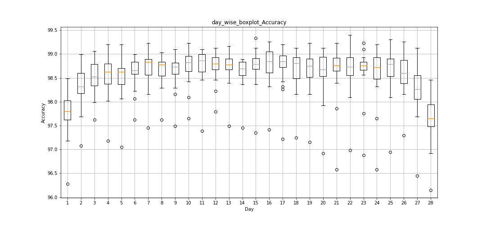
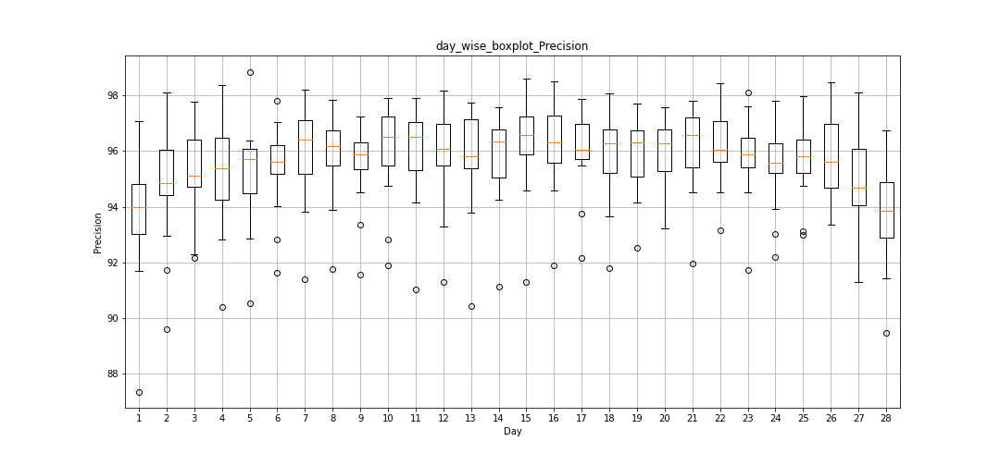
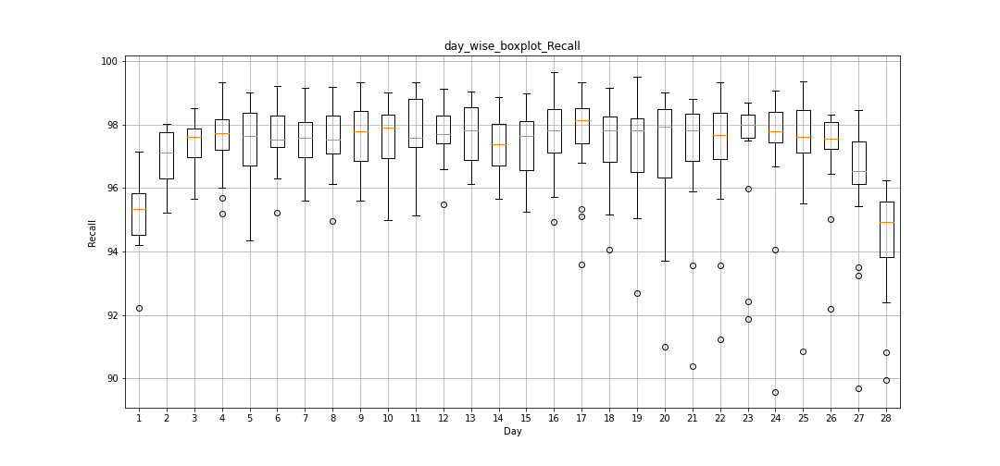
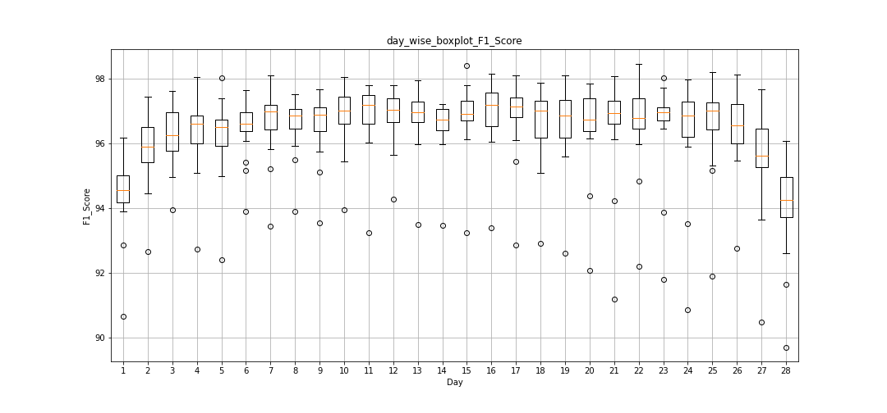

# Predicting Flash Drough occurances

## Getting Started

- Clone this repository

  ```Shell
  git clone git@github.com:Atishaysjain/Flash_Drought_Prediction.git;
  ```

- Navigate to the flash_drought_prediction folder

- Set up a Python3 environment with the provided requirements.txt file.
  ```Shell
  # This environment should have all packages required to execute the code
  pip install -r requirements.txt
  ```

## Input Data

The input raw data for our research has the following fields:

- rh (Relative Humidity): The percentage of the amount of humidity present in the air at a given temperature as compared to the maximum amount of humidity the air can hold at the temperature.
- SM (Soil Moisture): Measure of the amount of water present in the soil.
- Tmean (Mean Temperature)
- e (Ground Evaporation): Conversion of the moisture from the soil surface to water vapor that is released into the atmosphere. High temperatures can cause ground evaporation rates to increase, which can lead to rapid depletion of soil moisture and flash droughts.
- Date: Date at which the above parameters were recorded.

### Sample raw data

Check out the raw_data folder, it has 4 folders containing the data of

- Top 20 coordinates in India in terms of the number of occurances of flash droughts from 1st January 1980 to 31st December 2020.
- Percentile 60 coordinates in India in terms of the number of occurances of flash droughts from 1st January 1980 to 31st December 2020.
- Percentile 40 coordinates in India in terms of the number of occurances of flash droughts from 1st January 1980 to 31st December 2020.
- Bottom 20 coordinates in India in terms of the number of occurances of flash droughts from 1st January 1980 to 31st December 2020.

## Creating result directory

```Shell
python create_result_dir.py
```

```
Further options:
--results_dir              Path of the result directory [default: ./Results/lstm_results]
--n_days                  Number of days in the future for which the model will predict the probability of the occurance of Flash Drough [default: 28 (2 weeks)]
```

## Training Model to predict flash droughts and testing the trained model

```
python main.py
```

```
Further options:
   --data_folder              Path to the data folder [default: ./raw_data/]
   --result_folder            Path to directory where the results are to be stored [default: ./Results/lstm_results/]
   --n_days                   Number of days in the future for which the model will predict the probability of the occurance of Flash Drough [default: 28 (2 weeks)]
   --threshold                Value used to hard encode the value output from tanh function to -1(no flash drought) or 1 (flash drought) [value>threshold -> 1, value<threshold -> -1], i.e. classify the output as positive or negative flash drought. [Default: 0]
   --epochs                   Default: 50
   --batch_size               Default: 72
```

## Result directory structure

```
results_dir/
   ├── weights (stores the weights of the model for each of the coordinate in the dataset)
   ├── testing_prediction_data (stores the testing input data and predicted output)
         ├── y_test_instances_with_flash_drought.txt (Stores all the coordinates that experienced flash droughs as well as the date at which that coordinate faced a flash drought)
         ├── coordinate_1
               ├── day_1
                  ├── X_test.npy (stores the input test data)
                  ├── y_test.csv (stores the corresponding expected output - the output for the next n_days)
                  ├── y_pred_probability.csv (stores the predicted value (between -1 and 1) of the occurance of a flash drough - for the next n_days)
                  ├── y_pred.csv (hard coded rounded off value of y_pred_probability (-1 -> negative forecast) (+1-> positive forecast))
               ├── day_2
               ....
         ├── coordinate_2
         └── ...

   ├── 0.txt (average accuracy, precision, recall ad f1 score for the zeroth day over the set of coordinates)
   ├── 1.txt (average accuracy, precision, recall ad f1 score for the first day over the set of coordinates)
   ├── ....
   └── n.txt (average accuracy, precision, recall ad f1 score for the nth day over the set of coordinates)
```

## Creating summaries and plots

Check out summarizing_plotting_results.ipynb

- LstmResultsn.csv -> stores the average accuracy, precision, recall and f1-score of the predicted value on the nth day for each of the coordinates in the dataset.

- day_wise_summary.csv -> This file stores the mean accuracy, precision, recall and f1-score for each day across all the coordinates in that subset.

- Plots of the variation of accuracy, precision, recall and f1-score across n_days for each of the coordinates of that subset. The format of these files is data_lat_lon.png.
  Eg data_15.75_74.25.png: This will plot the variation of the accuracy, precision, recall and f1-score for the next n_days for coordinate with latitude 15.75 and longitude 74.25.

- The plots below are the box plot of the different metrics across the n_days of prediction

  - day_wise_boxplot_Accuracy.png
  - day_wise_boxplot_Precision.png
  - day_wise_boxplot_Recall.png
  - day_wise_boxplot_F1_Score.png

- The plots below are the line plot of the mean of the results over all the coordinates data across n_days of prediction
  - day_wise_summary_Accuracy.png
  - day_wise_summary_Precision.png
  - day_wise_summary_Recall.png
  - day_wise_summary_F1_Score.png

## Sample Plots

- Accuracy box plot over all the coordinates data with highest number of flash drought occurances with threshold value set as 0.
  

- Precision box plot over all the coordinates data with highest number of flash drought occurances with threshold value set as 0.
  

- Recall box plot over all the coordinates data with highest number of flash drought occurances with threshold value set as 0.
  

- F1-score box plot over all the coordinates data with highest number of flash drought occurances with threshold value set as 0.
  

## Getting Precision Recall curve

```Shell
python get_prc.py
```
Further Options:
```
--result_folder                   Path to the result folder that was passed in main.py, storing all the results
```

## Results folder

Use the link [Zipped Results](https://drive.google.com/file/d/1acBqjfxH5SuIh3khlDXzoT5rIUyAeSB1/view?usp=sharing) to download all the results.
